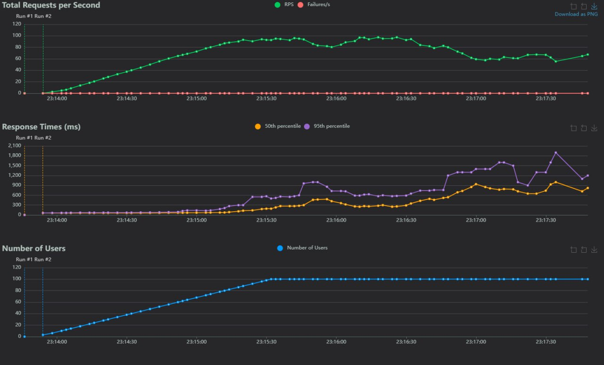

# Team 24, Hands-on 9 - Message Brokers

## Short System Description

We created a system that handles text messages with 4 services as separate deployable units. These services are the following:

- API - receives POST request from the users with their message and alias
- Filter - accepts or declines the message based on the absence or presence of stop-words
- Screaming - makes the whole message uppercase
- Publish - sends email to the emails of team members

The system has an event-driven architecture; messages are translated from one service to another one by message brokers (implemented with the use of RabbitMQ). We wrote this system in the Python programming language.

## Load-Testing and Performance Report

Here are screenshots of Locust showing load testing of Pipes and Filters and RabbitMQ:

Locust with Pipes and Filters

Locust with RabbitMQ

### Comparison of Results

| Metric                   | Pipes and Filters                 | RabbitMQ                      |
|--------------------------|------------------------------------|--------------------------------|
| Requests per Second   | Stable processing at ~130 RPS         | Unstable processing at ~80 RPS |
| Response Times (50th percentile) | Peaks early at ~2 s, then stays at ~0 s | Stable at ~0.3-0.4 s          |
| Response Times (95th percentile) | Peaks early at ~2 s, then stays at ~0 s | Fluctuates, peaking at ~2 s |
| Number of Users       | Linear growth, max ~100 users     | Linear growth, max ~100 users  |

### Observations

Pipes and Filters:

1. Shows faster response times after the startup phase.
2. Stable throughput under high load.

RabbitMQ:

1. Slower and more random response times.
2. Throughput declines after reaching the peak.

### Conclusion

Probably, due to the fact that messages in RabbitMQ need to be serialized, sent to the broker, stored in some temporary storage, and also due to the fact that we create a new RabbitMQ connection on every request to our API, RabbitMQ performs worse than Pipes and Filters.

You can view the code with RabbitMQ in `master` branch, with pipes and filters in `pipes_and_filters` branch.
